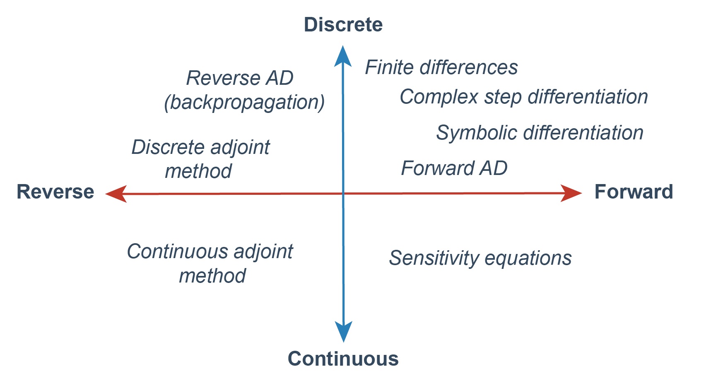

[](#contributors)


# A Review of Sensitivity Methods for Differential Equations

This respository contains all the text, code and figures used for the review paper about sentitivity methods for differential equations. This topic received different names in different communities, but the core problem is quite simple. Given a system of differential equations
```math
\frac{du}{dt} = f(u, \theta, t),
```
with $u \in \mathbb R^n$ the unknow solution and $\theta \in \mathbb R^p$ a vector of parameters, how do we compute the gradient of a loss function
```math
\mathcal L (\theta) = L ( u(\cdot, \theta) )
```
with respect to the parameters $\theta$ of the dynamical model?

There are different methods that try to solve this problem, and we had roughly classify them in the following scheeme.

<p align="center">
	
</p>  
<p align="center">	
	<i>Schematic classification of different methods to compute gradients of functions involving solutions of differential equations.</i>
</p>

The goal of this review is to revisit all this methods and compare them.

## Contributors

<!-- ALL-CONTRIBUTORS-LIST:START - Do not remove or modify this section -->
<!-- prettier-ignore-start -->
<!-- markdownlint-disable -->
<table>
  <tbody>
    <tr>
      <td align="center" valign="top" width="14.28%"><a href="http://facusapienza.org"><br /><sub><b>Facundo Sapienza</b></sub></a><br /><a href="#code-facusapienza21" title="Code">💻</a> <a href="#doc-facusapienza21" title="Documentation">📖</a> <a href="#infra-facusapienza21" title="Infrastructure (Hosting, Build-Tools, etc)">🚇</a> <a href="#maintenance-facusapienza21" title="Maintenance">🚧</a> <a href="#projectManagement-facusapienza21" title="Project Management">📆</a> <a href="#research-facusapienza21" title="Research">🔬</a></td>
      <td align="center" valign="top" width="14.28%"><a href="https://jordibolibar.wordpress.com"><br /><sub><b>Jordi Bolibar</b></sub></a><br /><a href="#doc-JordiBolibar" title="Documentation">📖</a> <a href="#example-JordiBolibar" title="Examples">💡</a> <a href="#ideas-JordiBolibar" title="Ideas, Planning, & Feedback">🤔</a></td>
    </tr>
  </tbody>
</table>

<!-- markdownlint-restore -->
<!-- prettier-ignore-end -->

<!-- ALL-CONTRIBUTORS-LIST:END -->


## Code :computer:

We provide code for the different simulations and examples we exhibit in the project. Most of this code is provided in the Julia programming language, given that many of the libraries to perform sensitivity analysis are supported there, plus Julia solvers for differential equations are currently the state of the art in scientific computing.

## How to use this repository :question:

This repository is organized in a way that contains most of the important elements of modern scientific workflow. We have included the following elements:
- `tex`: This is the folder where all the latex text belongs and what we use to compile `main.pdf`.
- `code`: Folder with both Jupyter notebooks and Julia scripts.
- `CI`: Continuous integration with GitHub actions to automatically compile and commit the manuscript. 
- `Makefile`: make file that automatizes all the commands that can be executed within this repository.

### Continuous integrations

This repository has a [workflow](https://github.com/ODINN-SciML/DiffEqSensitivity-Review/blob/main/.github/workflows/latex.yml) implemented that automatically compiles the latex files into the file `main.pdf` and then commits this file directy to the repository. 
If you are working from your fork, this action should also work and you should be able to generate the pdf file automatically using GitHub actions. 

### Makefile

Make is an old but very useful technology that allows automation of computing processes. From the directory where you have this respository you can enter `make help` from a terminal to display the different functionalities currently supported in our `Makefile`. We currently support the following operations:
- `make tex`: Compiles the `main.tex` latex file inside the folder `tex` with its respective bibliografy, deletes auxiliaries files in the process and them move the generated pdf file to the home directory.

## Open Science from Scratch: contribute to the project! :wave:

This review started with some of the authors willing to understand this tools in a comprehensive way and gathering references from fields like statistics, applied mathematics and computer science. Unhappy with the lack of a general compendium of the different methods that exists to address this problem, we had decided to make a single document where all the methods can coexists under common ground and can be compareded under their different scopes and domains of applications.

We are driving by learning and undersranding and the original authors of this report decided to manage this as an open science project from the beginning. What does this entitles? Anyone interested in participating and contrubuting is welcome to join. We beleive that science will benefit for more open collaborations happening under the basis of people trying to understand a topic.

We encourage contributors to participate in this project! If you are interested in contributing, there are many ways in which you can help build this:
- :collision: **Report bugs in the code.** You can report problems with the code by oppening issues under the `Issues` tab in this repository. Please explain the problem you encounter and try to give a complete description of it so we can follow up on that.
- :books: **Suggest new bibliography.** If you are aware of references that may be useful to explore and expand this review, you can report it by creating an `Issue` in this repository, with the title of the issue being the title of the paper and adding the label `paper` to the issue.
- :deciduous_tree: **Add contents.** You are more than welcome to directly contribute to this repository and add contents to it. In order to do so, you can directly make a Pull Request to this repository and we will review the changes before being accepted. If you want to get more and more involved in the project.
- :bulb: **Request new features and explanations.** If there is an important topic or example that you feel falls under the scope of this review and you would like us to include it, please request it! We are looking for new insights into what the community wants to learn.

### Make a Pull Request! :octocat:

The easiest way to contribute by adding code and/or text is to [create a new fork](https://docs.github.com/en/get-started/quickstart/fork-a-repo) of this repository and then [create a pull request](https://docs.github.com/en/pull-requests/collaborating-with-pull-requests/proposing-changes-to-your-work-with-pull-requests/creating-a-pull-request-from-a-fork) to the main
repository. You can add changes and explore new things in your own fork of this repository and then make a pull request to the repository asking to include some of the contents in the repository. Pull requests are the best way of merging different versions of a repository since it allows to open a conversation about the new implemented changes and solve potential merge conflicts at the same time.

**working from Overleaf?** You can create a Overleaf project that is synchronized with a GitHub repository (see [here](https://www.overleaf.com/learn/how-to/Git_Integration_and_GitHub_Synchronization) for more information). This allows you to do edits on the text file directly from Overleaf and then push your changes directly to your fork, from where you can make a pull request to the main repository.

## Contact 

If you have any questions or want to reach out, feel free to send us an email to `fsapienza@berkeley.edu`.

<!-- ## Reference

If you find this article useful, you can cite it as follows 
```

``` -->


